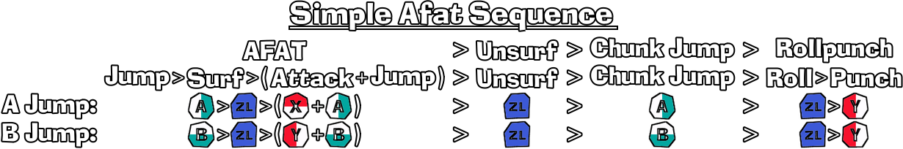

# DKB Input Sequence Generator
This application will take any sequence of moves or techs from Donkey Kong Bananza, convert it into controller inputs and display them nicely in an image with buttons to press.

The generated image can be customized to include the following:
- Sequence title
- Sequence as text
- Sequence inputs as text
- A jump control scheme button sequence
- B jump control scheme button sequence
- Color-coded button icons
- Directionally colored button icons based on the button's position on Nintendo controllers
- Various spacing and font options

## Examples

Here is an example of a generated sequence with all of these options enabled:



Here is an example of a shorter sequence with less information enabled:


## How does it work?
To create a sequence, simply type the moves, or techs you want included in the sequence, 
separated by any valid separator. Techs are a pre-determined sequences of moves that will be displayed as a group. 
The application will automatically transform the move sequence into an input sequence and display it using in-game button icons. 
For example, the Elefat example above was generated using the text `(Chunk Jump>Pull Ball)>(Surf>Attack+Jump)`

Here is a list of all valid separators:
`> + / , ( ) [ ] { } $`
<small>*Note that `$` is a special "empty" separator that will not be displayed. Useful for having no separator between moves.</small>

Here is a list of all supported moves:
```
Jump, Surf Jump, Surf, Unsurf, Boost, Attack, Swing, 
Down Swing, Up Swing, Neutral Swing, Stall, Punch, 
Forward Punch, Up Punch, Down Punch, DivePunch, 
Chunk Jump, Drop, Clap, Sing, Throw, Grab, Chunk Catch, 
Pull Ball, Aim, Cancel Aim, Release, Roll, Kong, Ostrich, 
Zebra, Elephant, Snake, Drumbeat, Transform, Detransform, 
WallJump, WallDrop, Right, Left, Forward, Back, Neutral, 
Neutral Drop, Test, Pause, Map, Skills Menu, Photo Mode, 
Twirl, Speedup
```

Here is a list of all supported techs and their input sequence:
```
Rollpunch: Roll > Punch
Rolljump: Roll > Jump
AFAT: Jump > Surf > (Attack+jump)
Surf AFAT: Surf Jump > Unsurf > Surf > (Attack+jump)
FAT: Jump (hold) > Surf > Attack
FART: Throw > (Roll > Grab) > (Surf > Attack+Jump)
CTJ: Grab > Wait 8f
LCTJ: Grab > Surf>Boost
CDJ: Down swing > Drop
CRJ: (Chunk jump > Chunk Catch) > (Surf > Attack+Jump)
Stall CRJ: Stall > (Chunk jump > Chunk Catch) > (Surf > Attack+Jump)
Elefat: (Chunk Jump > Pull Ball) > (Surf > Attack+Jump)
Elefart: (Roll > Pull Ball) > (Surf > Attack+Jump)
Relefat: Roll > (Jump > Pull Ball) > (Surf > Attack+Jump)
Fartephant: Throw > Roll > Grab > (Surf > Attack+Jump)
Stall Fartephant: (Down Swing > Throw) > Roll > Grab > (Surf > attack+Jump)
Catch Elefat: (Chunk jump>Chunk Catch) > (Surf > Attack+Jump)
Catch Relefat: Roll > Jump>Chunk Catch > (Surf > Attack+Jump)
Stall FART: (Down Swing > Throw) >> (Roll > Grab) > (Surf > Attack+Jump)
WallDrop AFAT: Neutral Drop > Left(Surf > Attack+Jump)
Normalize Cam: Aim > Cancel Aim
Juice Boost: Transform > Grab > Surf > Mash $Jump
IFAT: Repeat (Unsurf > Surf > Attack+Jump)
Flutter Stall: Repeat (Surf+Stall)
```

## Installation

If you simply want to use the apps, simply download the [latest release](https://github.com/Meuhy/DKBInputStringGenerator/releases/latest).

If you want to modify the app, then do the following:

Clone the repository:
`git clone https://github.com/Meuhy/DKBInputStringGenerator.git`
`cd DKBInputStringGenerator`

Create a virtual environment:
`python -m venv venv`

Activate it (Windows):
`.\venv\Scripts\Activate.ps1`

Install the required librairies:
`python -m pip install -r requirements.txt`

To run the app:
`python ui.py`

Generate the executable with
```python -m PyInstaller --onefile --windowed --name "DKB Input String Generator" --icon=icon.ico --add-data "fonts;fonts" --add-data "icons;icons" --add-data "icon.ico;." ui.py```